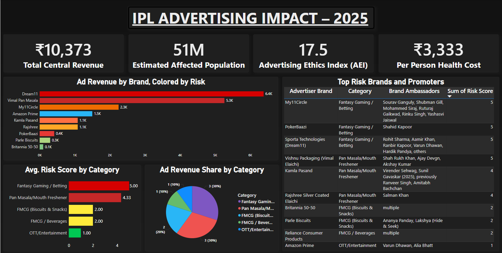

# 🏏 IPL 2025 Advertising Impact Analysis

A full-stack data analytics project that evaluates the economic gains vs. ethical risks of IPL 2025 advertisements. Built using **PostgreSQL** for data modeling and **Power BI** for interactive dashboards, this project dives into how brand advertising affects public health, regulation, and social behavior in India.

---

## 📊 Project Overview

- **Goal**: Measure the real impact of IPL advertising beyond revenue — uncover health costs, ethics violations, and regulatory failures.
- **Scope**: Focused on pan masala, fantasy gaming, and high-revenue brands featured during IPL 2025.
- **Approach**: Blended data modeling, ethics scoring, dashboarding, and policy simulation.

---

## 🧠 Key Insights

- ⚖️ **Advertising Ethics Index (AEI)**: IPL scored **17.5/100**, indicating weak ethical standards.
- 💸 **₹10,373 Cr Central Revenue**: Generated from advertisements, with heavy input from high-risk brands.
- 🧑‍⚕️ **₹1.5 Lakh Cr Public Health Burden**: Estimated long-term cost from surrogate pan masala ads.
- 📛 **Top Risk Brands**: Dream11, Vimal Elaichi, Kamla Pasand, My11Circle — all scored 4 or 5 on the risk index.
- 🧩 **Gaps Identified**: Weak surrogate ad enforcement, no fantasy sports regulation, and lack of brand endorsement ethics.

---

## 🗂️ Data Sources & Structure

**Primary Datasets:**

- `ipl_advertisers.csv`: Brand, category, revenue, risk scores, brand ambassadors
- `revenue_demography.csv`: Revenue segmented by sector, income group, and geography
- `summary_demography.csv`: Estimated population size by income bracket
- `ipl_contracts.csv`: Central sponsor contracts and revenue in crores

**External Research References:**

- Times of India – IPL revenue trends  
- FSSAI – Pan masala health risks  
- The Hindu – Fantasy sports legality  
- BCCI archives – Central sponsorship deals  
- Economic Times, WHO reports, IndiaSpend data  
- [Full list of sources here](./assets/references.pdf)

---

## 🛠️ Tools Used

| Tool        | Role                                |
|-------------|-------------------------------------|
| PostgreSQL  | SQL queries, joins, risk flagging   |
| Power BI    | Dashboard visuals, KPIs, slicers    |
| Excel       | Data preprocessing & formatting     |

---

## 📈 Final Dashboard

> 📌 KPI Cards | AEI Score | Category-wise Risk | Brand-wise Revenue | Recommendations



---

## 🧮 SQL Query Examples

```sql
-- Top risk brands by revenue
SELECT advertiser_brand, annual_revenue_crores, risk_score
FROM brand_revenue_risk
WHERE risk_score >= 4
ORDER BY annual_revenue_crores DESC;
```

```
-- Estimate affected population
SELECT SUM(avg_user_population * 0.15) AS estimated_affected
FROM demographic_summary;
```

📦 IPL-Advertising-2025
├── 📁 assets/                # Dashboard images, reference PDFs
├── 📁 sql/                   # Final SQL queries
├── 📁 data/                  # Cleaned CSVs used in Power BI
├── 📁 reports/               # Dashboard PDF export
└── README.md                # This file

## 🧑‍⚖️ Ethical & Regulatory Impact Metrics

**Ad Revenue (₹ Cr):** ₹10,373  
**Top Issues:**
- High-risk ad categories present (pan masala, betting)
- Employment boost limited to informal seasonal jobs
- Unethical categories dominate IPL visibility
- Public Health Burden: ₹1.5 Lakh Cr (long-term est.)
- AEI (Advertising Ethics Index) Score: ❌ **17.5 / 100**

> `AEI = Advertising Ethics Index`, a custom metric created for this project to measure brand-level ethical impact during IPL broadcasts.

---

## 🎯 Recommendations

- 🚫 Ban surrogate ads during IPL broadcasts
- ⚠️ Apply mandatory health disclaimers on harmful categories
- ✅ Introduce vetting for fantasy gaming endorsements
- 🧑‍⚖️ Form an independent ad ethics committee under BCCI
- 🌍 Align with global advertising standards (e.g. FIFA, Olympics)

---

## 🔮 Future Improvements

- 📈 Add time series data to project long-term revenue growth (CAGR)
- 🌐 Enable geo-filtering for regional risk zone analysis
- 🏉 Expand model to other sports (ISL, Pro Kabaddi, etc.)

---

## 👤 About Me

I’m an aspiring data analyst passionate about using data to drive ethical storytelling in sports. This IPL project combines SQL, Power BI, and public policy analysis to help fans and stakeholders better understand the real impact of brand advertising.

---


## 🎥 Project Walkthrough (YouTube)

▶️ Watch the full video presentation on YouTube:  
🔗 [IPL Advertising Ethics & Impact – Full Project Walkthrough](https://youtu.be/W4ZmSKyeqDg?si=OWcpE4P4YRgqlUtB)

This presentation covers:
- Dataset structure & preprocessing
- SQL analysis (pgAdmin demo)
- Power BI dashboard tour
- Ethics Index (AEI), policy gaps, and final recommendations

---


## 📁 Repository Structure

IPL-Advertising-2025/
├── assets/ # Dashboard images, reference PDFs
├── data/ # Cleaned CSVs used in Power BI
├── sql/ # Final SQL queries
├── reports/ # Dashboard PDF export
└── README.md # This file


📬 Contact

🌐 LinkedIn https://www.linkedin.com/in/anurag-mishra-b17051288/

📧 anuragmishrably800@gmail.com


---

Let me know if you want this saved as a file or want help building the folder structure (`assets`, `sql`, `data`, `reports`) too. Happy to help with that next.

Thank you for your support, and I look forward to connecting with you!
And don't hesitate to give me suggestions for better improvment.
